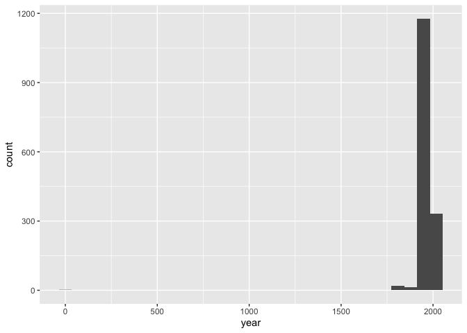
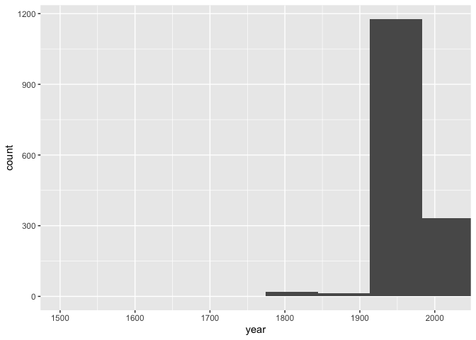
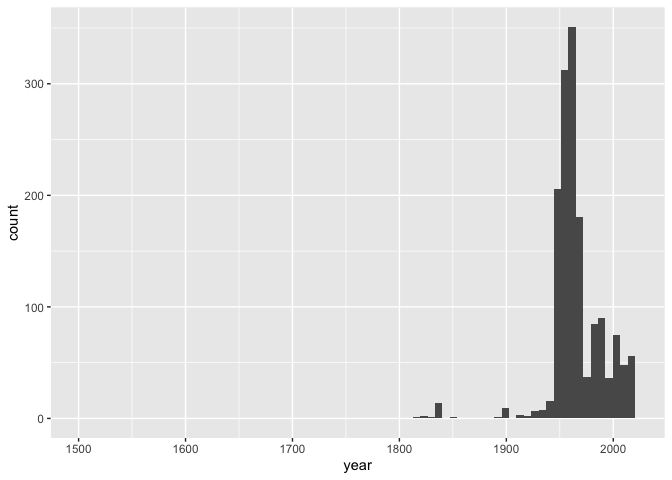

Lab 08 - University of Edinburgh Art Collection
================
Marq Schieber
3/22/22

### Load packages and data

``` r
library(tidyverse) 
library(stringr)
library(skimr)
```

``` r
# Remove eval = FALSE or set it to TRUE once data is ready to be loaded
uoe_art <- read_csv("data/uoe-art.csv")
```

### Exercise 10

``` r
uoe_art <- uoe_art %>%
  separate(title, into = c("title", "date"), sep = "\\(") %>%
  mutate(year = str_remove(date, "\\)") %>% as.numeric()) %>%
  select(title, artist, year, date)
```

    ## Warning: Expected 2 pieces. Additional pieces discarded in 38 rows [4, 103,
    ## 110, 168, 308, 510, 823, 846, 852, 935, 978, 1063, 1100, 1202, 1267, 1272, 1382,
    ## 1466, 1516, 1540, ...].

    ## Warning: Expected 2 pieces. Missing pieces filled with `NA` in 618 rows [3, 6,
    ## 19, 31, 35, 36, 38, 42, 48, 50, 55, 62, 64, 67, 74, 86, 87, 97, 104, 106, ...].

    ## Warning in str_remove(date, "\\)") %>% as.numeric(): NAs introduced by coercion

There were 3 warnings: 1)Discarded pieces 2)Discarded pieces replaced
with NA 3)Numeric-String computation error

### Exercise 11 Print out a summary of the dataframe using the skim() function. How many pieces have artist info missing? How many have year info missing?

``` r
skim(uoe_art)
```

|                                                  |         |
|:-------------------------------------------------|:--------|
| Name                                             | uoe_art |
| Number of rows                                   | 2910    |
| Number of columns                                | 4       |
| \_\_\_\_\_\_\_\_\_\_\_\_\_\_\_\_\_\_\_\_\_\_\_   |         |
| Column type frequency:                           |         |
| character                                        | 3       |
| numeric                                          | 1       |
| \_\_\_\_\_\_\_\_\_\_\_\_\_\_\_\_\_\_\_\_\_\_\_\_ |         |
| Group variables                                  | None    |

Data summary

**Variable type: character**

| skim_variable | n_missing | complete_rate | min | max | empty | n_unique | whitespace |
|:--------------|----------:|--------------:|----:|----:|------:|---------:|-----------:|
| title         |         1 |          1.00 |   0 |  86 |     8 |     1342 |          0 |
| artist        |       113 |          0.96 |   2 |  55 |     0 |     1102 |          0 |
| date          |       619 |          0.79 |   3 |  49 |     0 |      375 |          0 |

**Variable type: numeric**

| skim_variable | n_missing | complete_rate |    mean |    sd |  p0 |  p25 |  p50 |  p75 | p100 | hist  |
|:--------------|----------:|--------------:|--------:|------:|----:|-----:|-----:|-----:|-----:|:------|
| year          |      1368 |          0.53 | 1964.59 | 55.98 |   2 | 1953 | 1962 | 1980 | 2020 | ▁▁▁▁▇ |

artist missing = 113 year missing 1364

### Exercise 12 Make a histogram of years. Use a reasonable binwidth. Do you see anything out of the ordinary?

``` r
ggplot(uoe_art,aes(x=year))+
geom_histogram()
```

    ## `stat_bin()` using `bins = 30`. Pick better value with `binwidth`.

    ## Warning: Removed 1368 rows containing non-finite values (stat_bin).

<!-- -->

An art piece from year 0?….

``` r
ggplot(uoe_art,aes(x=year))+
geom_histogram()+
  coord_cartesian(xlim = c(1500 , 2022))
```

    ## `stat_bin()` using `bins = 30`. Pick better value with `binwidth`.

    ## Warning: Removed 1368 rows containing non-finite values (stat_bin).

<!-- -->

### Exercise 13 Find which piece has the out of the ordinary year and go to its page on the art collection website to find the correct year for it. Can you tell why our code didn’t capture the correct year information? Correct the error in the data frame and visualize the data again.

Death Mask. R got confused by the (2), which I’m guessing signifies it’s
the 2nd piece titled Death Mask.

``` r
uoe_art_v2 <- uoe_art %>% 
  mutate(
    year = if_else(
      year == "2" , "1964" ,
      if_else(year != "2" , paste0(year), "NA"
    ))) %>% 
  mutate(year = as.numeric(year))
```

``` r
ggplot(uoe_art_v2,aes(x=year))+
geom_histogram()+
  coord_cartesian(xlim = c(1500 , 2022))
```

    ## `stat_bin()` using `bins = 30`. Pick better value with `binwidth`.

    ## Warning: Removed 1368 rows containing non-finite values (stat_bin).

<!-- -->

\###Who is the most commonly featured artist in the collection? Do you
know them? Any guess as to why the university has so many pieces from
them?

Emma Gillies. I am not familiar with her work. I’m guessing alumna? Or
local artist?

``` r
uoe_art_v2 %>% 
  count(artist) %>% 
  arrange(desc(n))
```

    ## # A tibble: 1,103 × 2
    ##    artist               n
    ##    <chr>            <int>
    ##  1 Unknown            352
    ##  2 Emma Gillies       144
    ##  3 <NA>               113
    ##  4 John Bellany        20
    ##  5 Ann F Ward          19
    ##  6 Zygmunt Bukowski    17
    ##  7 Boris Bućan         16
    ##  8 Gordon Bryce        16
    ##  9 Marjorie Wallace    16
    ## 10 William Gillon      15
    ## # … with 1,093 more rows

\###Final question! How many art pieces have the word “child” in their
title? See if you can figure it out, and ask for help if not.

10, tried with “child” and no results

``` r
uoe_art_v2 %>% 
  filter(str_detect(title , "Child"))
```

    ## # A tibble: 9 × 4
    ##   title                                                       artist  year date 
    ##   <chr>                                                       <chr>  <dbl> <chr>
    ## 1 "Virgin and Child"                                          Unkno…    NA <NA> 
    ## 2 "Child's collar. Chinese"                                   Unkno…    NA <NA> 
    ## 3 "Virgin and Child "                                         Unkno…    NA stat…
    ## 4 "Untitled - Children Playing "                              Monik…  1963 1963)
    ## 5 "The Children's Hour "                                      Eduar…    NA 1974…
    ## 6 "Woman with Child and Still Life "                          Cathe…  1938 1938)
    ## 7 "Child's chinese headdress"                                 Unkno…    NA <NA> 
    ## 8 "Virgin and Child "                                         Unkno…    NA Tond…
    ## 9 "Figure Composition with Nurse and Child, and Woman with B… Edwar…    NA Circ…
